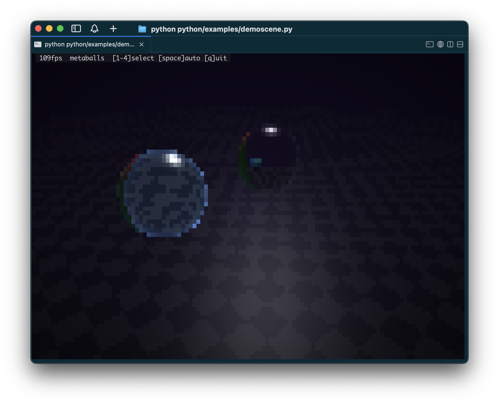
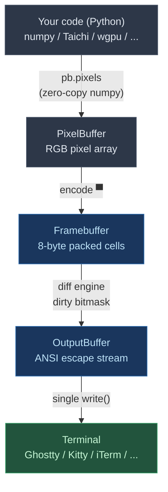

# cliviz

<p align="center">
  
</p>

High-throughput terminal pixel engine. Treats your terminal as a pixel display using Unicode half-block characters (`▀`) for 2x vertical sub-pixel resolution. The C++ core handles terminal I/O, differential rendering, and ANSI escape generation. You bring the pixels — from numpy, GPU compute, or any source.

## Install

```bash
uv pip install .
```

## Usage

```python
import cliviz
import numpy as np

with cliviz.Terminal() as term:
    pb = cliviz.PixelBuffer(term.cols, term.rows)
    pixels = pb.pixels  # numpy (H, W, 3) uint8 — zero-copy into C++ buffer

    pixels[10:20, 10:30] = [255, 0, 0]  # write pixels with numpy
    pb.flush_full()                       # encode + write to terminal
```

## API

```python
# Terminal lifecycle
with cliviz.Terminal() as term:
    term.cols, term.rows       # dimensions
    term.was_resized()         # poll for SIGWINCH

# Color mode: auto-detected, or override
with cliviz.Terminal(color_mode="256") as term: ...      # Terminal.app
with cliviz.Terminal(color_mode="truecolor") as term: ... # Ghostty/Kitty

# Pixel buffer
pb = cliviz.PixelBuffer(cols, rows)
pb.pixels                      # numpy (H, W, 3) uint8, zero-copy
pb.set(x, y, r, g, b)
pb.clear(r, g, b)
pb.fill_rect(x0, y0, x1, y1, r, g, b)

# Text overlay (terminal's native font)
pb.draw_text(col, row, "text", fg_r, fg_g, fg_b, bg_r, bg_g, bg_b)

# Frame output
pb.flush()                     # encode dirty + diff + write (partial updates)
pb.flush_full()                # encode all + write (full redraws)

# Split pipeline for text overlays on full redraws
pb.encode_all()                # pixels → cells
pb.draw_text(0, 0, "60fps")   # after encode, before present
pb.present()                   # diff + write to terminal

# Adaptive frame pacing
pacer = cliviz.FramePacer(target_fps=60)
while running:
    dt = pacer.pace()          # sleeps, adapts to terminal throughput
    # ... render ...
    pb.present()
```

## Architecture



## Why C++ instead of pure Python?

The ANSI serialization path — building variable-length escape sequences for thousands of cells per frame — requires sub-millisecond throughput. The C++ core is ~500 lines: the thinnest possible native layer. Everything above the pixel buffer (rendering, scene logic, GPU compute) stays in Python.

## Development

```bash
# Python
uv pip install -e ".[test]"
uv run python -m pytest

# C++
cmake -B build -DCMAKE_BUILD_TYPE=Release
cmake --build build
ctest --test-dir build
```

## License

MIT
