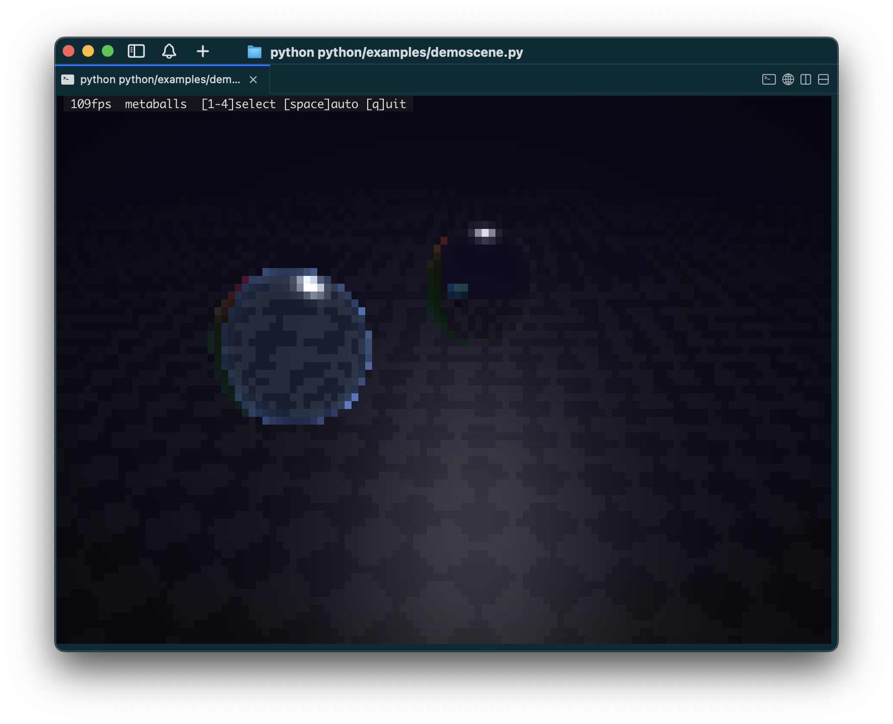
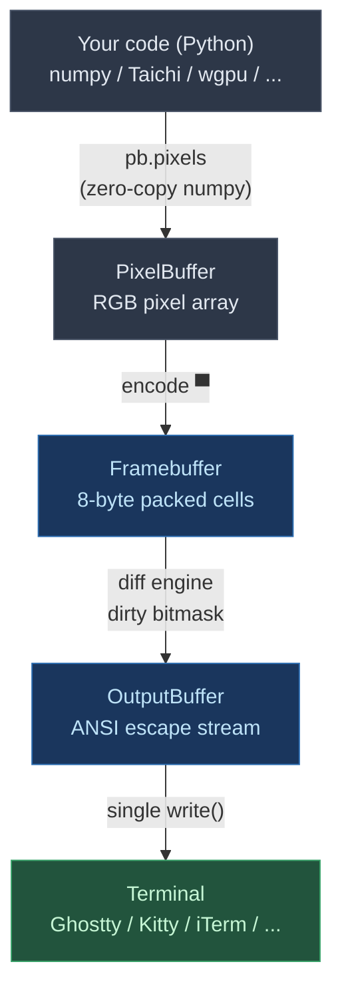

# cliviz

<p align="center">
  
</p>

High-throughput terminal pixel engine. Treats your terminal as a pixel display using Unicode half-block characters (`▀`) for 2x vertical sub-pixel resolution. The C++ core handles terminal I/O, differential rendering, and ANSI escape generation. You bring the pixels — from numpy, GPU compute, or any source.

## Install

```bash
pip install cliviz
```

Or from source:

```bash
git clone https://github.com/jonkhler/cliviz.git && cd cliviz
pip install .
```

### Build requirements (source installs only)

| Tool | Minimum |
|------|---------|
| CMake | 3.21 |
| C++ compiler | C++20 (clang 14+, gcc 12+) |
| Python headers | matching your Python version |

These are only needed when building from source (`pip install .`). Binary wheels require nothing beyond Python and numpy.

## Usage

```python
import cliviz
import numpy as np

with cliviz.Terminal() as term:
    pb = cliviz.PixelBuffer(term.cols, term.rows)
    pixels = pb.pixels  # numpy (H, W, 3) uint8 — zero-copy into C++ buffer

    pixels[10:20, 10:30] = [255, 0, 0]  # write pixels with numpy
    pb.flush_full()                       # encode + write to terminal
```

## API

```python
# Terminal lifecycle
with cliviz.Terminal() as term:
    term.cols, term.rows       # dimensions
    term.was_resized()         # poll for SIGWINCH

# Color mode: auto-detected, or override
with cliviz.Terminal(color_mode="256") as term: ...      # Terminal.app
with cliviz.Terminal(color_mode="truecolor") as term: ... # Ghostty/Kitty

# Ctrl-C / SIGTERM: poll in main loop
with cliviz.Terminal() as term:
    while not term.was_interrupted():
        ...

# Pixel buffer
pb = cliviz.PixelBuffer(cols, rows)
# pb.width  == cols
# pb.height == rows * 2  (pixel rows; two per terminal row via ▀)
# pb.term_rows == rows   (terminal rows, same as the 'rows' argument)
pb.pixels                      # numpy (height, width, 3) uint8, zero-copy
pb.set(x, y, r, g, b)
pb.clear(r, g, b)
pb.fill_rect(x0, y0, x1, y1, r, g, b)

# Text overlay (terminal's native font)
pb.draw_text(col, row, "text", fg_r, fg_g, fg_b, bg_r, bg_g, bg_b)

# Frame output
pb.flush()                     # encode dirty + diff + write (partial updates)
pb.flush_full()                # encode all + write (full redraws)

# Split pipeline for text overlays on full redraws
pb.encode_all()                # pixels → cells
pb.draw_text(0, 0, "60fps")   # after encode, before present
pb.present()                   # diff + write to terminal

# Adaptive frame pacing — pace() goes after present(), not before render
pacer = cliviz.FramePacer(target_fps=60)
while running:
    # ... render ...
    pb.present()
    dt = pacer.pace()          # sleeps for remaining frame budget; returns actual dt
```

## Examples

| Example | Command | Extra dependency |
|---------|---------|-----------------|
| Plasma / fire / starfield | `uv run python python/examples/plasma.py` | — |
| SDF (CPU) | `uv run python python/examples/sdf_cpu.py` | — |
| SDF (Taichi GPU) | `uv run python python/examples/sdf_taichi.py` | `uv pip install "cliviz[gpu]"` |
| SDF (Warp GPU) | `uv run python python/examples/sdf_warp.py` | `uv pip install "cliviz[gpu]"` |
| Demoscene | `uv run python python/examples/demoscene.py` | `uv pip install "cliviz[gpu]"` |
| Browser | `uv run python python/examples/browser.py [url]` | `uv pip install "cliviz[browser]"` then `playwright install chromium` |

## Architecture


```mermaid
graph TD
    A["Your code (Python)<br/>numpy / Taichi / wgpu / ..."] -->|"pb.pixels<br/>(zero-copy numpy)"| B
    B["PixelBuffer<br/>RGB pixel array"] -->|encode ▀| C
    C["Framebuffer<br/>8-byte packed cells"] -->|diff engine<br/>dirty bitmask| D
    D["OutputBuffer<br/>ANSI escape stream"] -->|"single write()"| E
    E["Terminal<br/>Ghostty / Kitty / iTerm / ..."]

    style A fill:#2d3748,stroke:#4a5568,color:#e2e8f0
    style B fill:#2d3748,stroke:#4a5568,color:#e2e8f0
    style C fill:#1a365d,stroke:#2b6cb0,color:#bee3f8
    style D fill:#1a365d,stroke:#2b6cb0,color:#bee3f8
    style E fill:#22543d,stroke:#38a169,color:#c6f6d5
```

## Why C++ instead of pure Python?

The ANSI serialization path — building variable-length escape sequences for thousands of cells per frame — requires sub-millisecond throughput. The C++ core is ~500 lines: the thinnest possible native layer. Everything above the pixel buffer (rendering, scene logic, GPU compute) stays in Python.

## Development

```bash
# Python
uv pip install -e ".[test]"
uv run python -m pytest

# C++
cmake -B build -DCMAKE_BUILD_TYPE=Release
cmake --build build
ctest --test-dir build
```

## License

MIT
